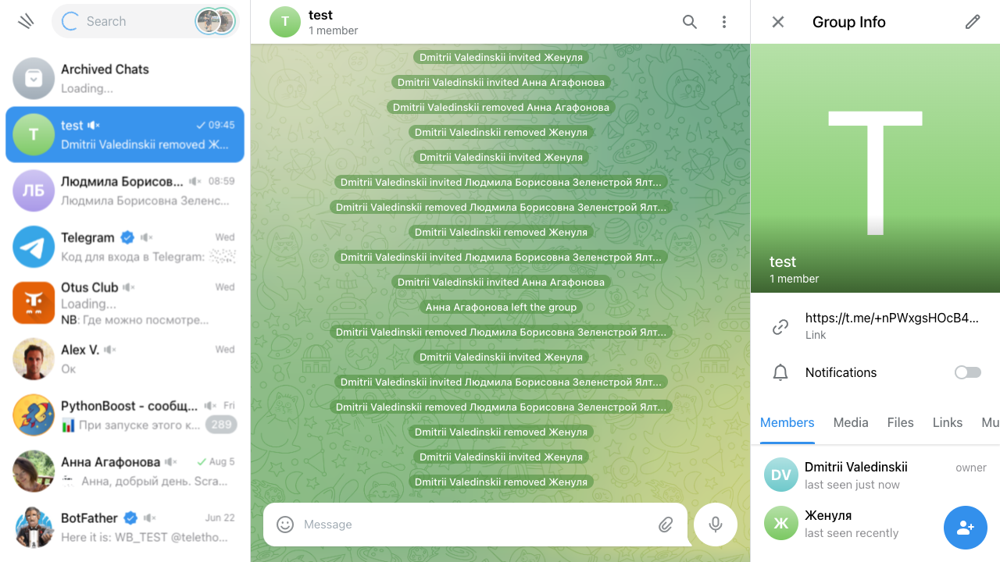

# teleinv
Telegram group/channel automated invitor.

## Общая информация

Скрипт предназначен для добавления пользователей в группу в телеграмме.
Скрипт готов к тесту.

Цель: избежать использования Telegram API.

Имитируем добавление пользователей вручную с использованием Playwright.
https://pypi.org/project/playwright/

Порядок действий скрипта:
- Начальная ручная авторизация в Telegram.
- Поиск существующей группы
- Переход в раздел Информация
- Клик "Добавить пользователя"
- Итерация по массиву ников пользователей
- Поиск пользователя
- Пользователь добавлен в группу

За счет использования session storage ручной вход в дальнейшем не нужен.
Для использования в ответственных случаях необходимо добавить блок поиска реальных имен пользователей
с использованием Telethon (например) и верификацией имени пользователя перед добавлением в группу.
Также напрашивается проверка пользователя на предмет бот - не бот.

Сложности: попал в ловушку https://web.telegram.org/a/, https://web.telegram.org/к/
В последнем применен другой HTML код, например, у кнопки 'Add user' отсутствует title='Add user'
что крайне затрудняет автоматизацию действий.

## Запуск скрипта

В первый раз снимаем коммент с await asyncio.sleep(60), потом опять закрываем.
Вводим номер телефона и код в открывшемся окне браузера в первый раз (headless=False).
В корне автоматически появится хранилище сессий.
Предоставляем массив ников пользователей и название уже существующей телеграмм группы.
Запускаем.

## Тесты

Тестировал вручную используя двух пользователей в своем телеграмм.

